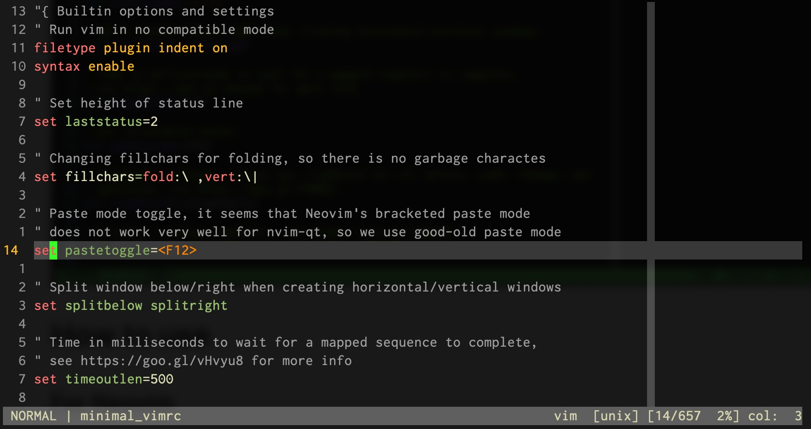

# Introduction

This is a minimal Vim/[Neovim](https://github.com/neovim/neovim) configuration
in just one file without external dependencies. The purpose is to provide a
light-weight and ready-to-use Vim config for quick editing.

The config is tested in Vim 7.4, Vim 8.0 and Nvim 0.4.0.

<p align="center">

</p>


# How to use

## For Neovim

To use this config for Neovim, use the following command:

```bash
mkdir -p ~/.config/nvim && cd ~/.config/nvim
git clone https://github.com/jdhao/minimal_vim.git .
```

## For Vim

```bash
mkdir -p ~/.vim && cd ~/.vim
git clone https://github.com/jdhao/minimal_vim.git .
```
